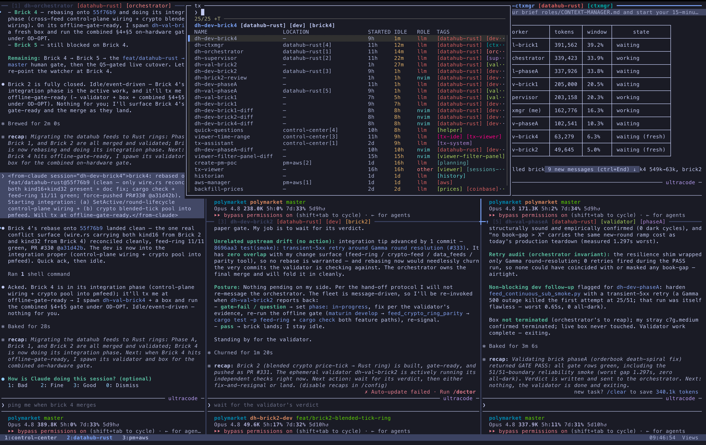
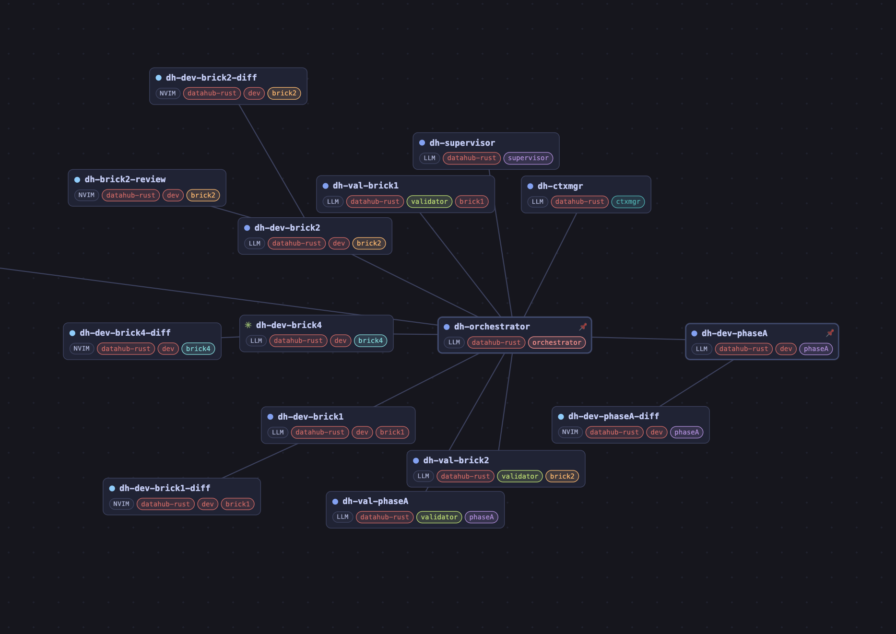

# tx-ide

A tmux + Claude Code session controller. One CLI (`tx`) gives every tmux session a **durable
record**, an fzf **picker** to find and attach them, verbs to **spawn** Claude Code workers and
nvim companions, **chat-operations** (fork / handover / rollover) over the conversations behind a
session, a centralized **history** of every chat, and a repo/branch/model **statusline**.

There is no daemon and no background process. State lives in plain JSON records under
`$TX_IDE_HOME`; every read reconciles those records against the live tmux server, and Claude Code
hooks drive each session's state as you work.

Layered as an additive install: code lives in the cloned repo (`git pull` updates it in place), and
all runtime state goes into files **tx-ide owns** under `$TX_IDE_HOME` (default `~/.tx-ide`). The
installer only ever touches your `~/.claude/settings.json` through a self-describing marked block,
and backs up anything it edits. `./uninstall` puts it all back.

## Screenshots



*The control-center — every tmux session in one multi-pane fleet view, each pane labelled with its role, tags, and live state.*



*The sessions-graph viewer — chats and their fork / handover / rollover provenance as an interactive node graph.*

## Concepts

### Sessions and durable records

Every tx-created tmux session has a **durable record** at `$TX_IDE_HOME/sessions/<uuid>.json`
holding its `name`, `role`, `state`, `cwd`, `cmd`, `tags`, `env`, `parent`, `pid`, `attached_to`,
timestamps, and (for an llm session) `chats`. One tmux pointer — `@tx_id`, set once at spawn — links
the live session to its record, so the record survives a `kill-session` or a tmux restart. Records
are the single source of truth; `tags` is a **field in the record**, not a tmux option (read it by
resolving `@tx_id`, change it through `tx tag`, never `tmux set @tag`). `role` (`llm` / `nvim` /
`shell` / `other`) is derived from the launch command at spawn — it is shown (its own column in
`tx attach`), not set, and never belongs in `tags`.

### Views vs Processes

- **Views** — home-base outer sessions you live in. A view is **not a record**: it is a live tmux
  session marked by the `@tx_view` option, which is its whole durable identity (it dies with the
  tmux server and is recreated by `tx spawn-view`). It carries no tags, is not listed by `tx ls` or
  the `tx attach` picker (it is visible in tmux itself), and its only tx lifecycle verbs are
  `tx spawn-view` and `tx kill`. Views nest-attach inner sessions and give you a stable surface.
- **Processes** — everything with a record: the `tx-assistant`, AI workers, nvim companions, ad-hoc
  shells. `tx ls` is a single processes listing, and these are what you pick from in `tx attach`.

### State

Each record carries a role-dependent `state`, shown as a column in `tx ls` / `tx attach` and driven
by Claude Code hooks:

- non-llm sessions: `alive` → `exited`.
- llm sessions: `working` (a turn is running) → `waiting` (turn finished, **needs you**) → `idle`
  (alive, no active turn), plus `exited` / `archived`.

The picker's "needs you" highlight is a `waiting` llm session. A reconcile sweep on every read
stamps vanished sessions `exited` and demotes a stuck `working` session back to `idle`.

### Tags

Tags are free-form **scope** chips rendered in the picker and on pane borders — nothing else. A
session's *role* (`llm` / `nvim` / `shell`) is **not** a tag: it is derived from the launch command
and shown as its own ROLE column in `tx attach`, so never put `llm` / `nvim` / `shell` in `--tag`.
The convention is just one scope per session — an AI worker tagged `auth-review`, its nvim companion
tagged the same `auth-review` so the two surface together. Set tags at spawn (`--tag`),
non-interactively with `tx tag`, or in the picker with `Ctrl-T`. The ROLE column is searchable, so
filtering by `llm` / `nvim` still works.

### Chats and chat-operations

A session can host several **chats** over its life. Each is a `ChatRef` with an `origin`
(`{how, session_id, chat_id}`) that records where it came from, forming a provenance DAG. Three
verbs operate on the conversation(s) behind a session:

- **`fork`** — start a NEW session whose chat begins with the full history of the source chat.
- **`handover`** — distill a source chat into a focused brief for a NEW worker session.
- **`rollover`** — rotate the SAME session onto a fresh chat (when context is exhausted).

`tx resume` is the related "bring back the past" verb: re-spawn a past session and reattach its
existing chat via `claude --resume`.

### History and the HISTORIAN

Every Stop and SessionEnd mirrors the active chat's **bundle** (`transcript.jsonl` + tool-result and
subagent sidecars) into `$TX_IDE_HOME/history/<tx-id>/<chat>/`, detached so it never adds latency;
`tx archive` forces a final, complete ingest. This gives a centralized, greppable corpus of every
conversation tx has run. The **HISTORIAN** role (`agents/HISTORIAN.md`) is a read-only consumer of
that corpus: it scopes from the records, greps the matched bundles, and synthesizes across many past
sessions.

### The tx-assistant

The `tx-assistant` is a persistent Claude Code session (named `tx-assistant`) you talk to from a
one-line `prefix+/` popup. Each line is one orchestration operation — spawn a worker, kill a
session, retag, message a peer. It follows `agents/TX-ASSISTANT.md`.

## Commands

`tx` / `tx help` prints the summary table. The public verbs:

### Spawn

| Command | What it does |
|---|---|
| `tx spawn <name> --tag TAGS [--cwd DIR] [--cmd CMD] [--engine ENGINE] [--prompt TEXT] [--model MODEL] [--effort {1,2,3,4,5}] [--read-only] [--env K=V …]` | Spawn a detached tmux session. Claude/Codex agents launch from a detached `$TX_IDE_HOME/worktrees/<repository-key>/<repository>--<name>` checkout. Both footers show `<repository>--<name>` without a branch. Engine-built launches translate effort as `1=low`, `2=medium`, `3=high`, `4=xhigh`, and `5=max`; omission defaults to `3`. `--read-only` keeps shell inspection available while blocking repository edits. LLM chats are captured automatically. |
| `tx spawn-nvim <name> --tag TAGS [--cwd DIR] [--diff [BASE]] [--env K=V …]` | Spawn a detached nvim companion. `--diff [BASE]` opens a diffview (base defaults to `main`). The plugins this relies on (diffview.nvim, gitsigns, tokyonight) ship in the repo's `nvim/` config — provision it with `setup/nvim.sh install` (or the installer's nvim prompt). |
| `tx spawn-view <name> [--cwd DIR] [--cmd CMD] [--env K=V …]` | Spawn a detached view session — a live `@tx_view` tmux home, not a store record (carries no tags). |

### Inspect

| Command | What it does |
|---|---|
| `tx ls` | List current (live) sessions (a single PROCESSES listing; views live in tmux, not the store). |
| `tx show <id\|name>` | Print a session record as JSON. |
| `tx history [--tag T] [--cwd C] [--since YYYY-MM-DD] [--until YYYY-MM-DD]` | List past (EXITED / ARCHIVED) sessions, filtered. |
| `tx chat ls <session>` | List a session's chats (ChatRefs) and their history-bundle paths. |
| `tx attach` | Open the interactive fzf session picker. |

### Chat operations

| Command | What it does |
|---|---|
| `tx fork <source> [new_name] [--read-only]` | Fork a session's chat into a NEW worktree-backed session that starts with the full history. The fork is writable unless explicitly read-only. |
| `tx handover <source> <task> [new_name] [--self-catch-up] [--read-only]` | Distill a session's chat into a focused brief for a NEW worktree-backed worker session. The worker is writable unless explicitly read-only. |
| `tx rollover [session] [--self-catch-up]` | Rotate a session onto a fresh chat in the SAME pane (context exhausted). |
| `tx resume <id\|name> [--as NAME] [--cwd DIR]` | Re-spawn a past session and reattach its chat (`claude --resume`); collision-safe. |

### Manage

| Command | What it does |
|---|---|
| `tx tag <name> [tags]` | Read (no arg) or set a session's tags (comma-separated). |
| `tx rename <name> <new_name>` | Rename a session — both the tmux session and its record. |
| `tx kill <name>` | End a tmux session and mark its record EXITED. |
| `tx archive <name>` | Retire a session (mark ARCHIVED, keep the record) and force a full history ingest. |
| `tx rm <id\|name>` | Delete a session record (manual GC; leaves any live tmux session running). |
| `tx send-message <target> <body>` | Peer-message another agent session (wraps the `<from-agent …>` envelope, handles the post-send pause). |
| `tx sync push\|pull\|status [--remote PATH] [--s3 BUCKET[/PREFIX]]` | Manual archive sync of the reproducible corpus — never on the hot path. |
| `tx start [-r\|--restart]` | Ensure the `Views` home base + `tx-assistant` exist, then attach `Views`. |

### The picker (`tx attach`)

`tx attach` is the one interactive front-end, bound to `prefix+t` as a centered popup. It lists
current (non-view) live sessions with their role, tag chips, and attachment location, refreshing ~1 Hz
(reconcile-on-read). Inside it:

- type to filter; `-f QUERY` pre-fills the search.
- `Ctrl-T` retags the highlighted session in a popup.
- `Ctrl-D` twice kills the highlighted session (the second press confirms).
- `-j` / `--jump` focuses the existing pane already hosting a session instead of nest-attaching here.

## Orchestration via the tx-assistant

Run `tx start` once to create the `Views` home base and warm the assistant. After that, hit
`prefix+/` from anywhere in tmux and tell it what to do — e.g. *"spawn a coding worker for
~/Code/my-project on the auth-rewrite plan"* — and it launches a worker that follows
`agents/DEVELOPER.md`. It manages tx-ide (sessions, the `tx` CLI, tags, peer messaging) and spawns
sessions; it does not do git, code edits, or multi-step plans itself — those go to a worker. See
`agents/TX-ASSISTANT.md` for its full contract.

## `$TX_IDE_HOME` layout

All runtime state lives under `$TX_IDE_HOME` (resolve the env var; default `~/.tx-ide`):

```
$TX_IDE_HOME/
  sessions/<uuid>.json        canonical session records (schema_version 2)
  history/<tx-id>/<chat>/      ingested chat bundles (transcript + sidecars)
  log.jsonl                    append-only provenance log of everything tx did
  config.json                  runtime config (see below)
  agents/      → repo/agents   shipped role files (symlink; updates with `git pull`)
  user-agents/                 your role overrides + `.local.md` companions
  hooks/{pre,post,end}.sh      Claude hook shims (generated at install, paths baked in)
  statusline.sh                the Claude Code statusline script
```

`sessions/`, `history/`, and `user-agents/` are created on first use; the `agents` symlink and the
`hooks/` shims are created by the installer.

## `config.json`

Optional runtime knobs, read live (no restart):

```json
{
  "stuck_working_threshold_seconds": 600,
  "sync": { "backend": "local", "path": "~/tx-archive" }
}
```

- **`stuck_working_threshold_seconds`** (int seconds, default `600`) — how long a `working` llm
  session may sit idle, with its pane no longer running the agent, before the reconcile sweep
  demotes it back to `idle`.
- **`sync`** — the remote backend for `tx sync` (otherwise pass `--remote` / `--s3`):
  - `{"sync": {"backend": "local", "path": "~/tx-archive"}}` — a local archive directory.
  - `{"sync": {"backend": "s3", "bucket": "my-bucket", "prefix": "tx/"}}` — S3 (backend deferred).

These are the only keys tx reads; the schema is open, so unknown keys are ignored.

## Install

```bash
git clone <this-repo> ~/Desktop/Coding/tx-ide
cd ~/Desktop/Coding/tx-ide
./install
```

The model mirrors how Claude Code itself installs: the **cloned repo is the source of truth** (a
`git pull` updates tx-ide in place), and the home directory holds only state. `./install` is
**click-through, idempotent, and backs up every file it edits**. It:

- symlinks the `tx` CLI onto your `PATH` (`~/.local/bin`),
- creates the `$TX_IDE_HOME` skeleton,
- generates the C9-baked Claude hook shims (+ statusline) under `$TX_IDE_HOME`, and
- registers those hooks in `~/.claude/settings.json` via the unified engine installer
  `setup/engines/install.sh` (Claude by default; Codex is opt-in via `--engine codex`), behind a
  self-describing marker so re-runs and uninstall are exact and your other hooks are left untouched.

It also offers (per-machine, `[y/N]`) to **provision the bundled nvim config**: the repo ships a
complete LazyVim setup under `nvim/` — tokyonight, diffview.nvim, gitsigns with inline-diff
keymaps, and keymap-usage telemetry (`keylog.jsonl`) — i.e. everything `tx spawn-nvim --diff`
relies on. Opting in symlinks `~/.config/nvim → <repo>/nvim` (an existing config is moved to
`nvim.bak.<stamp>`, never deleted). Flip the choice any time:

```bash
setup/nvim.sh install   # use tx-ide's nvim config on this machine
setup/nvim.sh remove    # unlink, restore the most recent backup
setup/nvim.sh status    # show what ~/.config/nvim currently is
```

Re-run any time to update or reconcile drift. After it finishes:

```bash
tx help     # see available commands
tx start    # create Views + warm the tx-assistant
```

## Uninstall

```bash
./uninstall
```

Reverses what `./install` did (the per-engine half is `setup/engines/install.sh uninstall`: it
surgically strips only the marker-recorded hook commands from `settings.json`, restores the
statusline reference, and removes the generated shims — leaving your records, history, log, and role
overrides in place).

## Customizing the view

The tmux integration reads these user-options (all default `on`). Set them in your `~/.tmux.conf`
**above** the line that sources the tx-ide view:

```tmux
set -g @tx-ide-popups          on                 # prefix+t (tx attach), prefix+/ (tx-assistant)
set -g @tx-ide-pane-borders    on                 # pane-border integration + colors
set -g @tx-ide-agent-scroll    on                 # C-u / C-d → PageUp / PageDown in agent panes
set -g @tx-ide-pane-keys       on                 # M-1..9 → select-pane
set -g @tx-ide-window-keys     on                 # User0..8 → select-window
set -g @tx-ide-session-labels  on                 # prefix+s shows each session's name + tags
set -g @tx-ide-palette         tokyonight-night   # or 'off' to skip color overrides
```

tmux's "last write wins" means anything you bind *after* the source line overrides tx-ide's
defaults.

### Theme

tx-ide assumes your Claude Code theme is a dark ANSI theme so terminal colors line up with the
picker. It doesn't change yours for you — set it via `/config` or `~/.claude/settings.json`.

### Palette

Hex literals live in `shared/palette.sh` (tokyonight-night). `install` bundles
`setup/tokyonight-night.itermcolors` and imports it into iTerm as a Custom Color Preset, then asks
whether to apply it to your Default profile. Switching palettes is a manual edit: update
`shared/palette.sh`, regenerate the `.itermcolors` via `setup/_gen-itermcolors.py`, then re-run
`./install`.

## Role files

The shipped roles live under `agents/` in this repo and are exposed at `$TX_IDE_HOME/agents/` via
symlink, so `git pull` updates them for every install:

- `agents/COMMON.md` — conventions every session must follow (spawn recipes, session metadata,
  peer messaging, the AINote workflow).
- `agents/TX-ASSISTANT.md` — the assistant role (how to interpret requests, what to spawn, guard
  rails).
- `agents/DEVELOPER.md` — the coding foundation + interactive developer: coding standards, git
  workflow, self-verify; you converse with the human, who reviews and merges.
- `agents/WORKFLOW-DEVELOPER.md` — the build-fleet layer on `DEVELOPER.md`: orchestrator-spawned,
  runs its own codex QA, reports codex-clean, emits fixtures.
- `agents/ORCHESTRATOR.md` — drives a multi-agent build: decompose, spawn developers, gate on
  codex-clean, merge autonomously, sequence phases.
- `agents/OVERSIGHT.md` — watches a running build (context-rollover + direction) and is the sole
  human contact.
- `agents/HISTORIAN.md` — the read-only history-synthesis role.

### Overrides

Drop files under `$TX_IDE_HOME/user-agents/`:

- `<ROLE>.local.md` — **extends** the shipped role (read alongside it; both apply).
- `<ROLE>.md` — **replaces** the shipped role outright (same filename shadows it).
- `<NEW-ROLE>.md` — adds a brand-new role you can spawn workers for.

Every worker-spawn prompt reads `$TX_IDE_HOME/agents/<ROLE>.md` followed by both
`user-agents/<ROLE>.md` and `user-agents/<ROLE>.local.md` if present.

## Requirements

- macOS (the iTerm2 palette/key integration is macOS-only; the core CLI is portable).
- `tmux`, `fzf` (≥ 0.63 — the picker uses the `footer` color element), and `python3.14` (the session store runs under 3.14; the package is stdlib-only).
- Claude Code and/or Codex (the agent engines tx spawns and whose hooks drive session state).

## License

MIT.
